# Laporan Proyek Machine Learning - Rafael Siregar

## Domain Proyek

Diabetes mellitus merupakan salah satu penyakit kronis yang menjadi masalah kesehatan utama di seluruh dunia. Menurut World Health Organization (WHO), jumlah penderita diabetes terus meningkat setiap tahunnya dan diperkirakan akan menjadi penyebab utama kematian pada dekade mendatang [1]. Deteksi dini terhadap risiko diabetes sangat penting agar penderita dapat segera mendapatkan penanganan yang tepat dan mencegah komplikasi lebih lanjut.

Namun, proses diagnosis diabetes secara konvensional membutuhkan pemeriksaan laboratorium yang memakan waktu dan biaya. Oleh karena itu, diperlukan solusi berbasis teknologi yang dapat membantu tenaga medis maupun masyarakat dalam melakukan prediksi risiko diabetes secara cepat dan akurat. Salah satu solusi yang dapat digunakan adalah penerapan machine learning untuk memprediksi kemungkinan seseorang menderita diabetes berdasarkan data kesehatan yang tersedia.

Masalah ini harus diselesaikan karena deteksi dini diabetes dapat menurunkan angka komplikasi dan kematian akibat penyakit ini. Dengan model prediksi yang baik, proses skrining dapat dilakukan secara massal dan efisien, sehingga membantu pengambilan keputusan medis dan meningkatkan kualitas hidup masyarakat.

Beberapa penelitian telah menunjukkan bahwa algoritma machine learning seperti Random Forest, K-Nearest Neighbors, dan Boosting mampu memberikan hasil prediksi yang baik untuk kasus klasifikasi diabetes [2][3]. Oleh karena itu, pada proyek ini akan dibangun model prediksi diabetes berbasis machine learning dengan tahapan preprocessing, balancing data, threshold adjustment, dan evaluasi performa model.

**Referensi:**

[1] World Health Organization. (2021). Diabetes. [Online]. Available: [https://www.who.int/news-room/fact-sheets/detail/diabetes](vscode-file://vscode-app/c:/Users/pael/AppData/Local/Programs/Microsoft%20VS%20Code/resources/app/out/vs/code/electron-sandbox/workbench/workbench.html)
[2] S. Sisodia and D. S. Sisodia, "Prediction of Diabetes using Classification Algorithms," Procedia Computer Science, vol. 132, pp. 1578-1585, 2018.
[3] S. Kavakiotis et al., "Machine Learning and Data Mining Methods in Diabetes Research," Computational and Structural Biotechnology Journal, vol. 15, pp. 104-116, 2017.

## Business Understanding

### Problem Statements

Menjelaskan pernyataan masalah latar belakang:

1. **Bagaimana memprediksi risiko diabetes pada pasien berdasarkan data kesehatan yang tersedia secara otomatis dan akurat?**
2. **Bagaimana meningkatkan performa model prediksi agar dapat mendeteksi lebih banyak kasus diabetes (recall tinggi) tanpa mengorbankan akurasi secara signifikan?**
3. **Bagaimana memilih model machine learning terbaik untuk prediksi diabetes pada dataset yang digunakan?**

### Goals

Menjelaskan tujuan dari pernyataan masalah:

1. **Membangun model machine learning yang mampu memprediksi risiko diabetes berdasarkan data pasien.**
2. **Meningkatkan recall pada kelas diabetes (positif) melalui balancing data dan threshold adjustment, sehingga lebih banyak kasus diabetes yang terdeteksi.**
3. **Membandingkan performa beberapa algoritma (KNN, Random Forest, Boosting) dan memilih model terbaik berdasarkan metrik evaluasi seperti accuracy, recall, precision, dan f1-score**

- #### Solution statements

  1. **Menggunakan beberapa algoritma machine learning (KNN, Random Forest, dan Boosting) untuk membangun model prediksi diabetes, kemudian membandingkan performanya.**
  2. **Melakukan balancing data menggunakan SMOTE untuk mengatasi masalah data tidak seimbang, sehingga model lebih sensitif terhadap kelas diabetes.**
  3. **Melakukan threshold adjustment pada model Random Forest untuk meningkatkan recall pada kelas diabetes.**
  4. **Mengukur performa model menggunakan metrik evaluasi seperti accuracy, recall, precision, dan f1-score agar solusi yang dihasilkan dapat terukur dan relevan dengan kebutuhan bisnis.**

## Data Understanding

Dataset yang digunakan dalam proyek ini adalah **Pima Indians Diabetes Database** yang diunduh dari [Kaggle](vscode-file://vscode-app/c:/Users/pael/AppData/Local/Programs/Microsoft%20VS%20Code/resources/app/out/vs/code/electron-sandbox/workbench/workbench.html). Dataset ini berisi data medis dari perempuan keturunan Pima Indian berusia di atas 21 tahun, dengan tujuan untuk memprediksi apakah seseorang menderita diabetes berdasarkan hasil pemeriksaan medis dan riwayat kesehatan.

### Variabel-variabel pada Pima Indians Diabetes Dataset adalah sebagai berikut:

* **Pregnancies** : Jumlah kehamilan yang pernah dialami.
* **Glucose** : Konsentrasi glukosa plasma 2 jam dalam tes toleransi glukosa oral.
* **BloodPressure** : Tekanan darah diastolik (mm Hg).
* **SkinThickness** : Ketebalan lipatan kulit trisep (mm).
* **Insulin** : Kadar insulin serum 2 jam (mu U/ml).
* **BMI** : Indeks massa tubuh (berat badan dalam kg/(tinggi badan dalam m)^2).
* **DiabetesPedigreeFunction** : Fungsi silsilah diabetes (menggambarkan kemungkinan diabetes berdasarkan riwayat keluarga).
* **Age** : Usia (tahun).
* **Outcome** : Kelas target (0 = tidak diabetes, 1 = diabetes).

### Exploratory Data Analysis (EDA)

Beberapa tahapan EDA yang dilakukan untuk memahami data antara lain:

* Menampilkan statistik deskriptif untuk setiap fitur.

  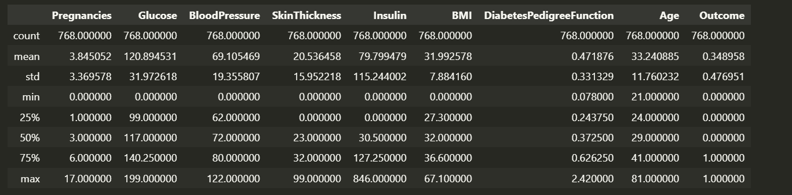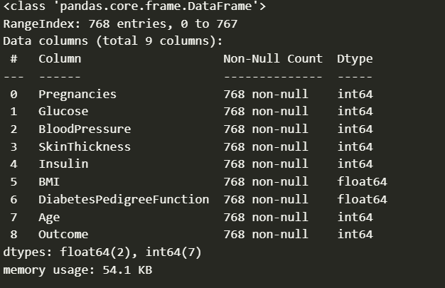
* Mengecek missing value dan nilai-nilai yang tidak wajar (outlier).

  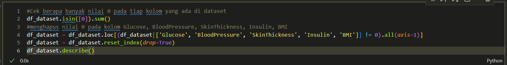

  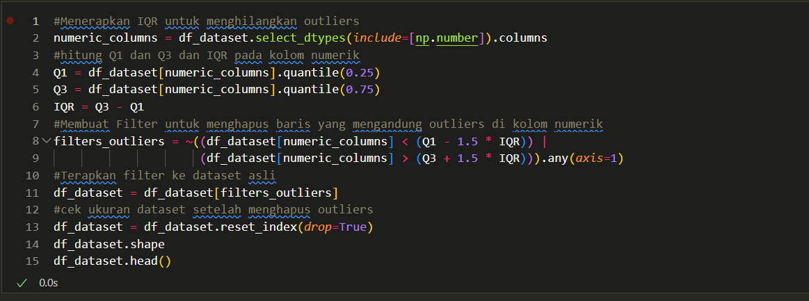
* Visualisasi distribusi data menggunakan dengan boxplot.

  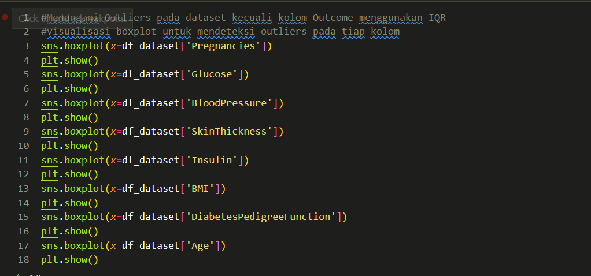
* Analisis korelasi antar fitur menggunakan heatmap.

  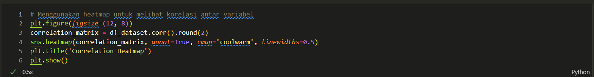

  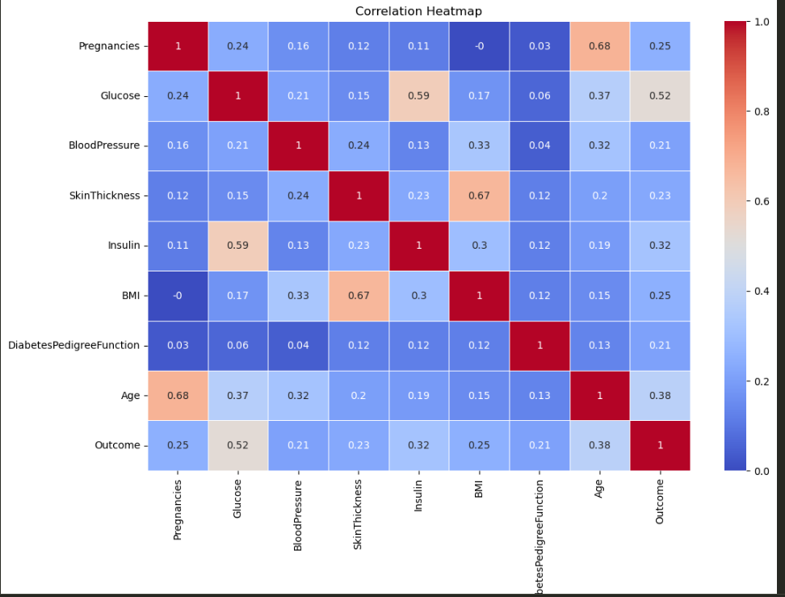
* Visualisasi hubungan antar fitur menggunakan pairplot.

  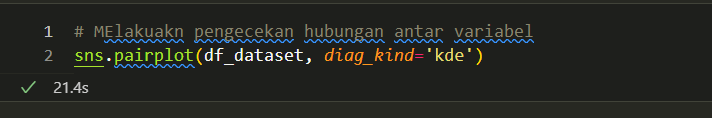

  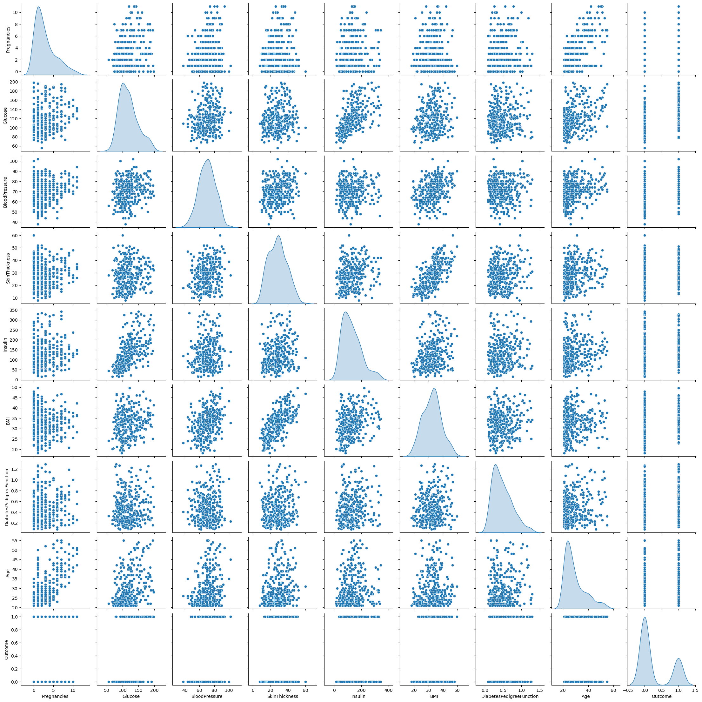

Tahapan ini membantu dalam memahami karakteristik data, mendeteksi masalah pada data, serta menentukan langkah preprocessing yang diperlukan sebelum membangun model machine learning.

## Data Preparation

Pada tahap ini, dilakukan beberapa teknik data preparation agar data siap digunakan untuk pemodelan machine learning. Berikut urutan dan penjelasan teknik yang digunakan:

1. **Menangani Outlier dengan IQR**
   Outlier pada fitur numerik diidentifikasi dan dihapus menggunakan metode Interquartile Range (IQR).
   *Alasan:* Outlier dapat menyebabkan model bias dan menurunkan performa prediksi.

   
2. **Reduksi Dimensi dengan PCA**
   Principal Component Analysis (PCA) digunakan untuk mereduksi beberapa fitur numerik menjadi dua komponen utama.
   *Alasan:* Reduksi dimensi membantu mengurangi kompleksitas data dan dapat meningkatkan performa model.

   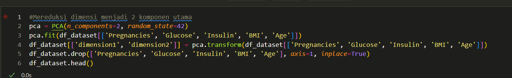
3. **Pembagian Data (Train-Test Split)**
   Data dibagi menjadi data latih dan data uji dengan rasio 80:20.
   *Alasan:* Untuk mengevaluasi performa model secara adil pada data yang belum pernah dilihat sebelumnya.

   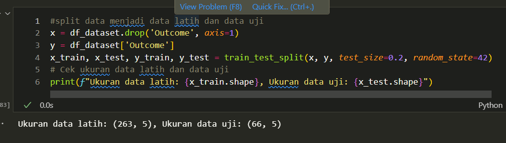
4. **Standarisasi Data**
   Semua fitur numerik distandarisasi menggunakan StandardScaler agar memiliki mean 0 dan standar deviasi 1.
   *Alasan:* Standarisasi diperlukan agar fitur dengan skala berbeda tidak mendominasi proses pelatihan model.

   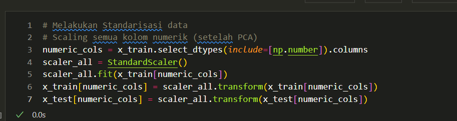

Setiap tahapan di atas dilakukan secara berurutan untuk memastikan data yang digunakan pada proses pemodelan sudah bersih, relevan, dan siap untuk menghasilkan model prediksi yang optimal.

## Modeling

Tahapan ini membahas mengenai model machine learning yang digunakan untuk menyelesaikan permasalahan prediksi diabetes. Pada tahap ini, balancing data dengan SMOTE dilakukan **sebelum proses pelatihan model** agar model tidak bias terhadap kelas mayoritas.

### 1. **Balancing Data dengan SMOTE**

Balancing data menggunakan Synthetic Minority Over-sampling Technique (SMOTE) dilakukan  **setelah data dibagi menjadi data latih dan data uji, namun sebelum proses pelatihan model** . SMOTE bertujuan untuk menyeimbangkan jumlah data pada kelas mayoritas dan minoritas dengan cara membuat data sintetis pada kelas minoritas.
*Alasan:* Data yang seimbang membantu model untuk lebih sensitif dalam mendeteksi kasus diabetes (kelas minoritas).

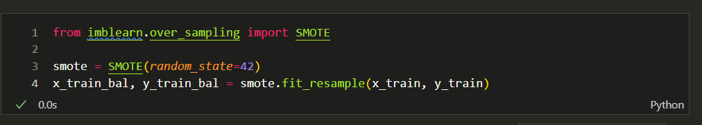

### 2. **Pemodelan Machine Learning**

Beberapa algoritma machine learning digunakan dan dibandingkan performanya, yaitu:

#### a. **K-Nearest Neighbors (KNN)**

* **Parameter utama:** n_neighbors=10
* **Kelebihan:** Sederhana, mudah diimplementasikan, tidak memerlukan pelatihan model secara eksplisit.
* **Kekurangan:** Sensitif terhadap skala data dan outlier, performa menurun pada dataset besar.

  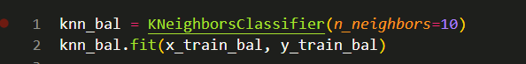

#### b. **Random Forest**

* **Parameter utama:** n_estimators=50, max_depth=10, random_state=42,n_jobs=-1
* **Kelebihan:** Mampu menangani data dengan banyak fitur, robust terhadap overfitting, dapat mengukur pentingnya fitur.
* **Kekurangan:** Model lebih kompleks, interpretasi lebih sulit dibanding model sederhana.
  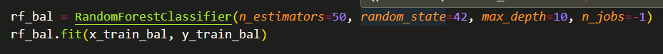

#### c. **AdaBoost (Boosting)**

* **Parameter utama:** learning_rate=0.1, algorithm="SAMME", random_state=42
* **Kelebihan:** Dapat meningkatkan akurasi model dengan menggabungkan beberapa model lemah, efektif untuk data tidak seimbang.
* **Kekurangan:** Sensitif terhadap data outlier dan noise, proses pelatihan lebih lama.

  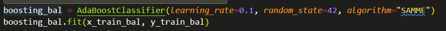

### 3. **Threshold Adjustment**

Pada model Random Forest hasil balancing, dilakukan penyesuaian threshold prediksi (threshold = 0.5) untuk meningkatkan recall pada kelas diabetes.
*Alasan:* Dengan threshold lebih rendah, model lebih banyak memprediksi kelas 1 sehingga recall meningkat, meskipun precision bisa sedikit menurun.

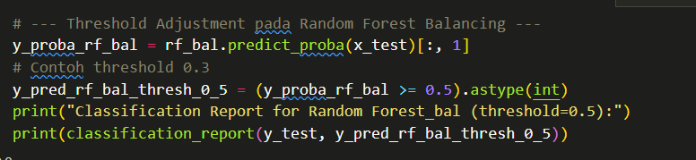

## Evaluatio

Pada proyek ini digunakan metrik **akurasi, precision, recall, dan f1-score** untuk mengukur performa model klasifikasi.

* **Akurasi** mengukur persentase prediksi yang benar dari seluruh data uji.
* **Precision** mengukur proporsi prediksi positif yang benar-benar positif.
* **Recall** mengukur proporsi kasus positif yang berhasil dideteksi oleh model.
* **F1-score** adalah rata-rata harmonis dari precision dan recall, memberikan gambaran keseimbangan antara keduanya.

### Hasil Evaluasi Model

Pada proyek ini, digunakan beberapa metrik evaluasi untuk mengukur performa model klasifikasi, yaitu:

* **Akurasi (Accuracy):** Persentase prediksi yang benar dari seluruh data uji.
  Formula:
  `Accuracy = (TP + TN) / (TP + TN + FP + FN)`
* **Precision:** Proporsi prediksi positif yang benar-benar positif.
  Formula:
  `Precision = TP / (TP + FP)`
* **Recall (Sensitivity):** Proporsi kasus positif yang berhasil dideteksi oleh model.
  Formula:
  `Recall = TP / (TP + FN)`
* **F1 Score:** Harmonic mean dari precision dan recall, memberikan gambaran keseimbangan antara keduanya.
  Formula:
  `F1 Score = 2 * (Precision * Recall) / (Precision + Recall)`

Keterangan:

* **TP (True Positive):** Kasus positif yang diprediksi benar
* **TN (True Negative):** Kasus negatif yang diprediksi benar
* **FP (False Positive):** Kasus negatif yang diprediksi positif
* **FN (False Negative):** Kasus positif yang diprediksi negatif

Berdasarkan hasil evaluasi pada data uji (66 data), diperoleh hasil sebagai berikut:

#### 1. **KNN_bal**

* Akurasi: **0.74**
* Precision kelas 1: **0.63**
* Recall kelas 1: **0.85**
* F1-score kelas 1: **0.72**

Model KNN_bal memiliki recall tertinggi pada kelas diabetes (1), yaitu 0.85, yang berarti model ini mampu mendeteksi sebagian besar kasus diabetes. Namun, precision-nya lebih rendah, sehingga ada beberapa false positive.

#### 2. **Random Forest_bal**

* Akurasi: **0.73**
* Precision kelas 1: **0.64**
* Recall kelas 1: **0.69**
* F1-score kelas 1: **0.67**

Model Random Forest_bal memiliki keseimbangan antara precision dan recall pada kelas diabetes, dengan nilai f1-score yang cukup baik.

#### 3. **Boosting_bal**

* Akurasi: **0.67**
* Precision kelas 1: **0.56**
* Recall kelas 1: **0.77**
* F1-score kelas 1: **0.65**

Model Boosting_bal memiliki recall yang cukup tinggi, namun precision dan akurasinya lebih rendah dibanding model lain.

#### 4. **Random Forest_bal (threshold=0.5)**

* Akurasi: **0.73**
* Precision kelas 1: **0.64**
* Recall kelas 1: **0.69**
* F1-score kelas 1: **0.67**

Threshold adjustment pada Random Forest dengan threshold 0.5 memberikan hasil yang sama dengan model default, dengan keseimbangan precision dan recall yang baik.

### Interpretasi Hasil

* **Model KNN_bal** sangat baik dalam mendeteksi kasus diabetes (recall tinggi), namun menghasilkan lebih banyak false positive (precision lebih rendah).
* **Model Random Forest_bal** dan **Random Forest_bal (threshold=0.5)** memberikan keseimbangan antara precision dan recall, sehingga cocok digunakan jika ingin mengurangi false positive tanpa terlalu banyak kehilangan recall.
* **Model Boosting_bal** memiliki recall yang cukup baik, namun precision dan akurasinya lebih rendah.

### Kesimpulan

Model terbaik dipilih berdasarkan kebutuhan bisnis dan tujuan utama proyek. Jika tujuan utama adalah  **mendeteksi sebanyak mungkin kasus diabetes (recall tinggi)** , maka model **KNN_bal** dapat dipilih. Namun, jika ingin keseimbangan antara mendeteksi kasus diabetes dan meminimalkan false positive, maka **Random Forest_bal** adalah pilihan yang lebih baik.

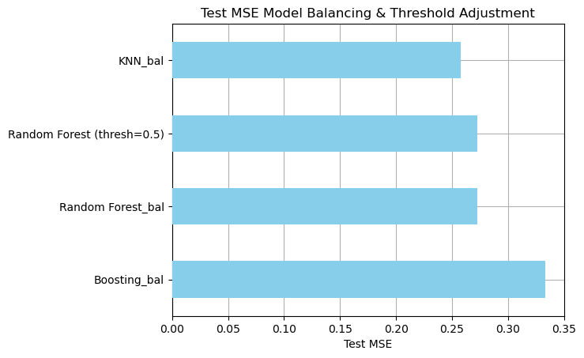

# HASIL PENGUJIAN PADA 66 Data Test

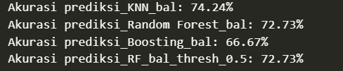
